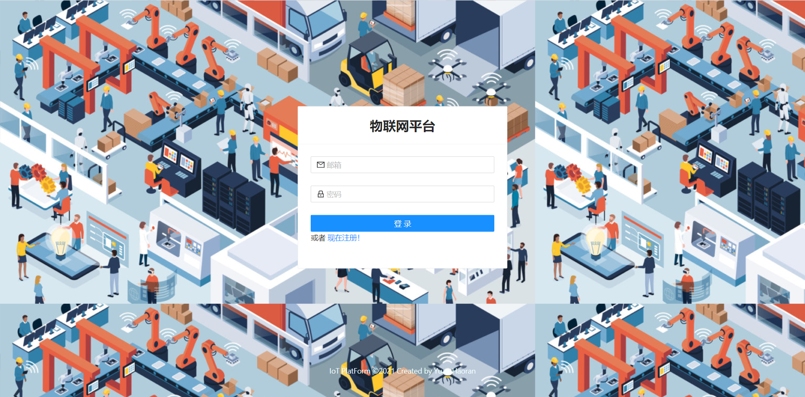
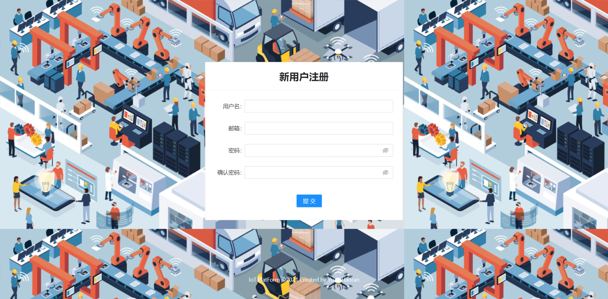
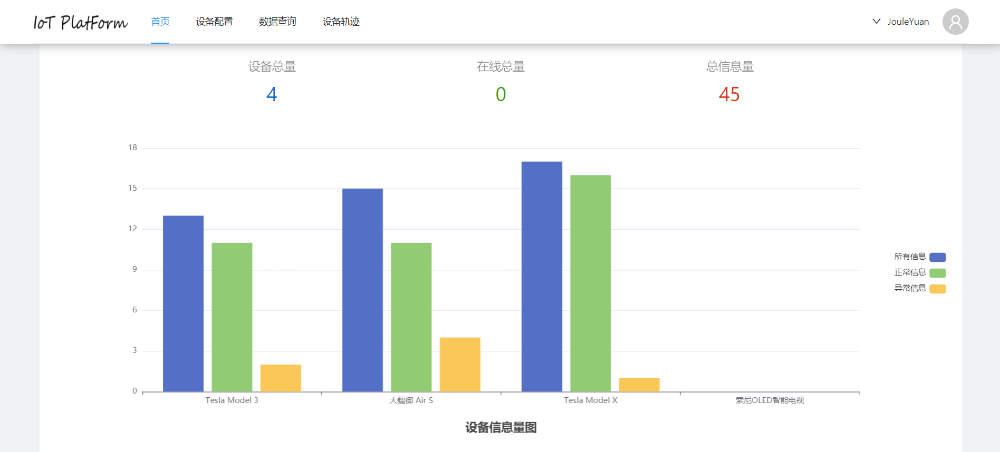
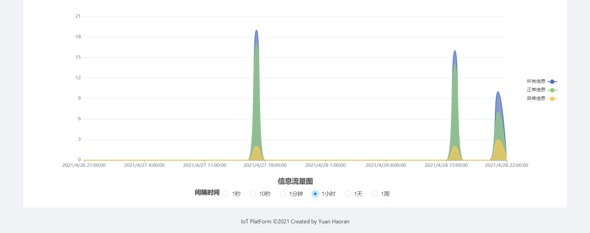
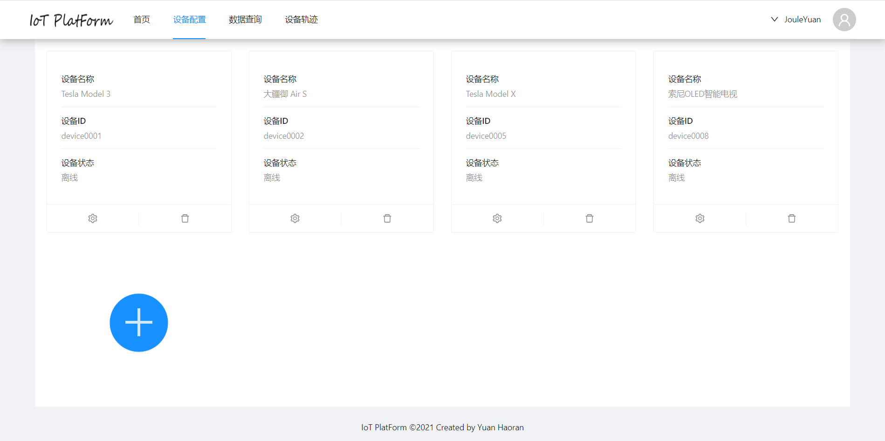
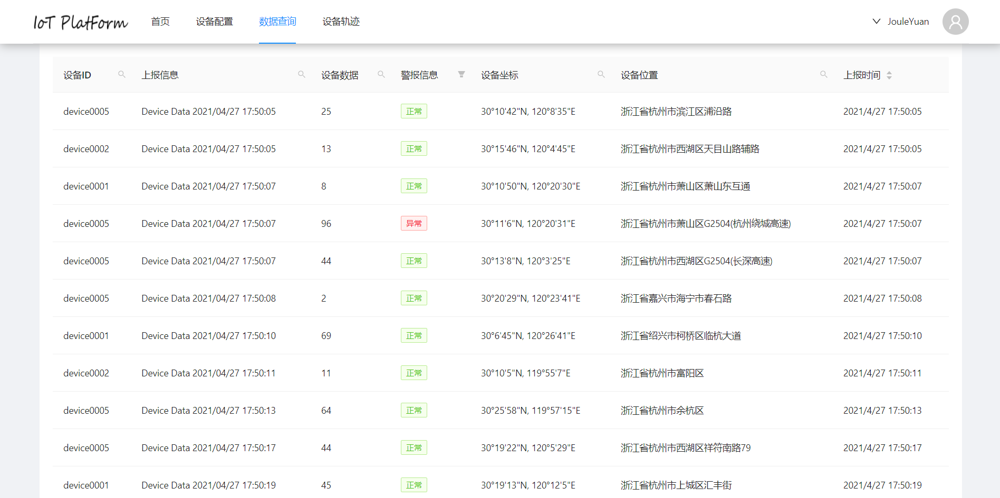
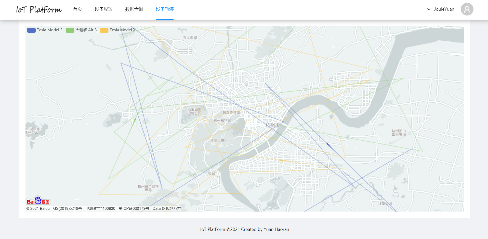

# IoT-Platform

This is a course project for ZJU B/S course. 

The IoT-Platform project is a web application based on React and Spring boot, which provides MQTT based IoT services.

## Build

### Database

Import IoT schema into MySQL database by the following SQL command.

```sql
create database IoT;
use IoT;
source /xxx/xxx/IoT/IoT.sql;
```

### Front-End

First, install all dependencies.

```shell
yarn install
```

After that, input the following command to generate the distribution code.

```shell
yarn build
```

### Back-End

In order to run the back-end program, you need to install [Redis](https://redis.io/) and [Mosquitto](https://mosquitto.org/), Luckily, configuration is not needed for these two services, which means you can just keep the default settings.

What's more, you should modify the database URL in application.yml, or the program can't connect to your own database.

Next, install all dependencies in pom.xml and run the following command to package the code into jar package.

```shell
mvn clean install
```

After that, you can run the back-end program.

### Port Forwarding

In order to do port forwarding, you need to install [Nginx](https://www.nginx.com/).

After installation, add the following codes into the config file of Nginx.

```
server {
        listen 80 default_server;
        listen [::]:80 default_server;
        
        # The path should be where the distribution code of the React project is.
        root /xxx/yyy;
        
        index index.html index.htm index.nginx-debian.html;
        
        location / {
                try_files $uri $uri/ /index.html;
        }
        
        location /api/ {
        		# This should be the address that runs the back-end program.
                proxy_pass http://xxx.xxx.xxx.xxx:yyyy/;
        }
}
```

Finally, reload Nginx by the following command, and the build process would be completed.

```shell
nginx -s reload
```

## Usage

### Virtual Device

Edit iot.properties and run the program. In default, the program would generate 5 threads, with each having a client ID from 'device0001' to 'device0005'. Please notice that only the messages sent by virtual devices that have been registered on the website would be received and stored by the back-end program.

### Website

You can visit ~~http: // 47.100.55.98/~~ (not available currently), if you haven't finish the build process.

#### Login



#### Signup



#### Home





#### Configuration



#### Search Data



#### Track Map

